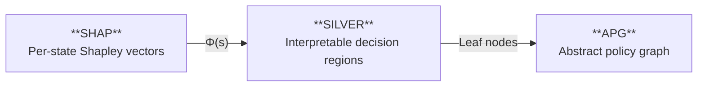

# Trustworthy Defense: Explainable Deep-RL for Moving Target Defense in 5G and Beyond Networks

This repository contains a post-hoc explainability framework for deep reinforcement learning agents trained in the [OptSFC](https://github.com/wsoussi/OptSFC) environment. OptSFC trains RL agents to perform Moving Target Defense (MTD) in 5G/NFV networks. This framework explains the decisions made by those trained agents without modifying their underlying policies.

Four explanation methods are implemented and evaluated across five RL algorithms: **DQN**, **PPO**, **A2C**, **Envelope**, and **EUPG**.

---

## Methods Overview

| Method | What is explained                                             | Output                          | Reference                                                                                                                                                                           |
| ------ | ------------------------------------------------------------- | ------------------------------- | ----------------------------------------------------------------------------------------------------------------------------------------------------------------------------------- |
| RDX    | Why action A is preferred over action B                       | Action comparison per objective | [Explainable RL via Reward Decomposition](https://finale.seas.harvard.edu/publications/explainable-reinforcement-learning-reward-decomposition)                                     |
| SHAP   | Which state features influence the policy or executed actions | Feature attribution             | [A Unified Approach to Interpreting Model Predictions](https://arxiv.org/abs/1705.07874); [Explaining Reinforcement Learning with Shapley Values](https://arxiv.org/abs/2306.05810) |
| SILVER | What decision rules approximate the policy globally           | Decision tree                   | [Interpret Policies in Deep RL using SILVER with RL-Guided Labeling](https://arxiv.org/abs/2510.19244)                                                                              |
| APG    | How decisions evolve across abstract states over time         | Policy graph                    | [Generation of Policy-Level Explanations for RL](https://arxiv.org/abs/1905.12044)                                                                                                  |

The methods form a pipeline: SHAP produces per-state Shapley vectors, SILVER uses them to learn interpretable decision regions, and the SILVER decision tree feeds directly into the APG as the state abstraction.



---

## Repository Structure

```
optsfc-explainable/
└── optsfc/envs/
    ├── rdx.py                          # RDX: Reward Difference Explanation
    ├── shap_argmax_explain.py          # SHAP (argmax / policy-centered)
    ├── shap_env_explain.py             # SHAP (env_action / behavior-centered)
    ├── silver_argmax_explain.py        # SILVER (argmax)
    ├── silver_env_explain.py           # SILVER (env_action)
    ├── apg_silver_argmax_explain.py    # APG driven by SILVER argmax decision tree
    ├── apg_silver_env_explain.py       # APG driven by SILVER env_action decision tree
├── rdx_evaluate.py                     # RDX visualization
├── rdx_single_step.py                  # RDX single-step analysis
├── shap_argmax_evaluate.py             # SHAP visualization and cross-algo comparison (argmax)
├── shap_env_evaluate.py                # SHAP visualization and cross-algo comparison (env_action)
└── data/
    ├── dqn_explain.csv
    ├── envelope_explain.csv
    ├── ppo_explain.csv
    ├── a2c_explain.csv
    └── eupg_explain.csv
```

---

## Method 1: RDX — Reward Difference Explanation

RDX explains action preference by comparing the Q-value difference between
the executed action and a contrast action, decomposed per reward objective
for MORL algorithms.

RDX outputs are logged directly during agent training in
OptSFC. The per-step explanation data is stored in `{algo}_explain.csv`
as part of the training pipeline.

For details on how to train agents and generate these files, refer to the
[OptSFC repository](https://github.com/your-org/optsfc).

### Outputs

```
data/
├── dqn_explain.csv
├── envelope_explain.csv
├── eupg_explain.csv
├── ppo_explain.csv
└── a2c_explain.csv
```

---

## Method 2: SHAP — Feature Attribution

SHAP attributes each state feature's contribution to the policy output using Shapley values. It is applied to the full vector of policy outputs across all 12 actions.

Five objective-related features are used (constraint features are excluded as they introduce temporal monotonic effects):

| Category | Feature                      |
| -------- | ---------------------------- |
| Resource | `feat_mean_mtd_overhead`     |
| Network  | `feat_mean_network_penalty`  |
| Network  | `feat_max_network_penalty`   |
| Security | `feat_mean_security_penalty` |
| Security | `feat_max_security_penalty`  |

### Run — policy-centered

```bash
# For each algorithm
python optsfc/env/shap_argmax_explain.py --input data/{algo}_explain.csv --algo {algo} --output shap_argmax_outputs

# DQN example run
python optsfc/env/shap_argmax_explain.py --input data/dqn_explain.csv --algo DQN --output shap_argmax_outputs
```

### Run — behavior-centered

```bash
python optsfc/env/shap_env_explain.py --input data/{algo}_explain.csv --algo {algo} --output shap_env_outputs
```

### Outputs

```
shap_argmax_outputs/
├── shap_dqn_scalar_Q_summary.csv       # mean |SHAP| and mean signed SHAP per feature
├── shap_envelope_scalar_Q_summary.csv
├── shap_ppo_policy_prob_summary.csv
├── shap_a2c_policy_prob_summary.csv
└── shap_eupg_policy_prob_summary.csv

shap_env_outputs/                       # same structure, all filenames carry _env suffix
```

### Visualization

```bash
# policy-centered
python shap_argmax_evaluate.py --data_root ./shap_argmax_outputs --out_dir ./shap_argmax_evaluation

# behavior-centered
python shap_env_evaluate.py --data_root ./shap_env_outputs --out_dir ./shap_env_evaluation
```

---

## Method 3: SILVER with RL-Guided Labeling

SILVER builds a global interpretable surrogate policy from the Shapley vectors produced by SHAP. It clusters states by their Shapley vectors, identifies boundary points between clusters, and fits a decision tree on those boundary states.

The decision tree is the primary output. It produces human-readable if-then rules over the five objective features that approximate the policy's global behavior.

### Run — policy-centered

```bash
# For each algorithm
python optsfc/envs/silver_argmax_explain.py --input data/{algo}_explain.csv --shap_dir shap_argmax_outputs --output silver_argmax_outputs --algo {algo}

# DQN example run
python optsfc/envs/silver_argmax_explain.py --input data/dqn_explain.csv --shap_dir shap_argmax_outputs --output silver_argmax_outputs --algo DQN
```

### Run — behavior-centered

```bash
python optsfc/envs/silver_env_explain.py --input data/{algo}_explain.csv --shap_dir shap_env_outputs --output silver_env_outputs --algo {algo}
```

### Outputs

```
silver_argmax_outputs/
├── silver_dqn_kmeans.pkl
├── silver_dqn_boundary_shap.csv        # 66 boundary points in Φ_s space
├── silver_dqn_boundary_state.csv       # 66 boundary points in state space
├── silver_dqn_decision_tree.pkl
├── silver_dqn_decision_tree.pdf        # visual tree diagram
├── silver_dqn_linear_regression.pkl
├── silver_dqn_logistic_regression.pkl
└── silver_dqn_formulas.txt             # human-readable equations

silver_env_outputs/                     # same structure, filenames carry _env suffix
```

---

## Method 4: APG — Abstract Policy Graph

APG uses the SILVER decision tree as the state abstraction. Each leaf of the decision tree becomes one abstract state in the graph. Every trajectory step is assigned to a leaf by passing its raw feature values through the tree via `tree.apply()`. Transitions between abstract states are computed as empirical frequencies between leaf assignments.

The APG only uses the behavior-centered of SILVER because its transition edges are built from the actual executed trajectory.

The results can be directly generated by running `apg_silver_env_explain.py`.

### Outputs

```
apg_silver_env_outputs/
├── silver_apg_dqn_env.png
├── silver_apg_dqn_env_assignments.csv      # per-step leaf ID, abstract state, g(s)
├── silver_apg_envelope_env.png
├── silver_apg_envelope_env_assignments.csv
├── silver_apg_ppo_env.png
├── ...
```

---

## Dependencies

```bash
pip install numpy pandas shap scikit-learn scipy matplotlib networkx
```
