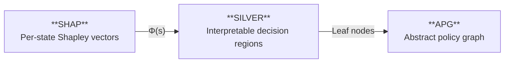

# Trustworthy Defense: Explainable Deep-RL for Moving Target Defense in 5G and Beyond Networks

This repository contains a post-hoc explainability framework for deep reinforcement learning agents trained in the [OptSFC](https://github.com/wsoussi/OptSFC) environment. OptSFC trains RL agents to perform Moving Target Defense (MTD) in 5G/NFV networks. This framework explains the decisions made by those trained agents without modifying their underlying policies.

Four explanation methods are implemented and evaluated across five RL algorithms: **DQN**, **PPO**, **A2C**, **Envelope**, and **EUPG**.

---

## Methods Overview

| Method | What is explained                                     | Output                          | Reference                                                                                                                                                                           |
| ------ | ----------------------------------------------------- | ------------------------------- | ----------------------------------------------------------------------------------------------------------------------------------------------------------------------------------- |
| RDX    | Why action A is preferred over action B               | Action comparison per objective | [Explainable RL via Reward Decomposition](https://finale.seas.harvard.edu/publications/explainable-reinforcement-learning-reward-decomposition)                                     |
| SHAP   | Which state features influence the executed action    | Feature attribution             | [A Unified Approach to Interpreting Model Predictions](https://arxiv.org/abs/1705.07874); [Explaining Reinforcement Learning with Shapley Values](https://arxiv.org/abs/2306.05810) |
| SILVER | What decision rules approximate the policy globally   | Decision tree                   | [Interpret Policies in Deep RL using SILVER with RL-Guided Labeling](https://arxiv.org/abs/2510.19244)                                                                              |
| APG    | How decisions evolve across abstract states over time | Policy graph                    | [Generation of Policy-Level Explanations for RL](https://arxiv.org/abs/1905.12044)                                                                                                  |

SHAP, SILVER, and APG all use `env_action` as the single explanation target across all algorithms. Each is run over two feature scopes, distinguished by output directory:

| Scope           | Features | Output directory suffix |
| --------------- | -------- | ----------------------- |
| Objective-level | 5        | (none)                  |
| Low-level       | 13       | `_raw`                  |

For example, `shap_env_outputs/` holds the objective-level results and `shap_env_outputs_raw/` holds the low-level results, with identical file naming inside each.

The methods form a pipeline: SHAP produces per-state Shapley vectors, SILVER uses them to learn interpretable decision regions, and the SILVER decision tree feeds directly into the APG as the state abstraction.


```mermaid
flowchart LR
    SHAP["**SHAP**\nPer-state Shapley vectors"]
    SILVER["**SILVER**\nInterpretable decision regions"]
    APG["**APG**\nAbstract policy graph"]

    SHAP -->|"Φ(s)"| SILVER
    SILVER -->|"Leaf nodes"| APG
```

---

## Repository Structure

```
optsfc-explainable/
├── optsfc/envs/
│   ├── rdx.py                          # RDX: Reward Difference Explanation
│   ├── shap_env_explain.py             # SHAP (env_action)
│   ├── silver_env_explain.py           # SILVER (env_action)
│   ├── apg_silver_env_explain.py       # APG driven by SILVER env_action decision tree
├── rdx_evaluate.py                     # RDX visualization
├── rdx_single_step.py                  # RDX single-step analysis
├── shap_env_evaluate.py                # SHAP visualization and cross-algo comparison
├── shap_surrogate_validation.py        # SHAP surrogate model validation
├── data/
│   ├── dqn_explain.csv
│   ├── envelope_explain.csv
│   ├── ppo_explain.csv
│   ├── a2c_explain.csv
│   └── eupg_explain.csv
├── shap_env_outputs/                   # SHAP, objective-level (5 features)
├── shap_env_outputs_raw/               # SHAP, low-level (13 features)
├── shap_env_evaluation/                 # SHAP visualizations, objective-level
├── shap_env_evaluation_raw/             # SHAP visualizations, low-level
├── silver_env_outputs/                 # SILVER, objective-level
├── silver_env_outputs_raw/             # SILVER, low-level
├── apg_silver_env_outputs/             # APG, objective-level
└── apg_silver_env_outputs_raw/         # APG, low-level
```

---

## Method 1: RDX — Reward Difference Explanation

RDX explains action preference by comparing the Q-value difference between
the executed action and a contrast action, decomposed per reward objective
for MORL algorithms.

RDX outputs are logged directly during agent training in
OptSFC. The per-step explanation data is stored in `{algo}_explain.csv`
as part of the training pipeline.

For details on how to train agents and generate these files, refer to the
[OptSFC repository](https://github.com/your-org/optsfc).

### Outputs

```
data/
├── dqn_explain.csv
├── envelope_explain.csv
├── eupg_explain.csv
├── ppo_explain.csv
└── a2c_explain.csv
```

---

## Method 2: SHAP — Feature Attribution

SHAP attributes each state feature's contribution to the executed action (`env_action`) using Shapley values, over two feature scopes.

**Objective-level scope** — 5 features, one per reward objective (raw security score features are excluded due to zero variance and replaced with proxy features):

| Category | Feature                      |
| -------- | ---------------------------- |
| Resource | `feat_mean_mtd_overhead`     |
| Network  | `feat_mean_network_penalty`  |
| Network  | `feat_max_network_penalty`   |
| Security | `feat_mean_security_penalty` |
| Security | `feat_max_security_penalty`  |

**Low-level scope** — 13 features, the full underlying state representation:

| Category | Feature                          |
| -------- | -------------------------------- |
| Resource | `feat_vim0_cpu`, `feat_vim1_cpu` |
| Resource | `feat_vim0_ram`, `feat_vim1_ram` |
| Resource | `feat_mean_mtd_overhead`         |
| Network  | `feat_mean_network_penalty`      |
| Network  | `feat_max_network_penalty`       |
| Network  | `feat_min_remaining_mig`         |
| Network  | `feat_mean_remaining_mig`        |
| Network  | `feat_mean_remaining_reinst`     |
| Network  | `feat_total_ues`                 |
| Security | `feat_mean_security_penalty`     |
| Security | `feat_max_security_penalty`      |

### Run

```bash
# Objective-level
python optsfc/envs/shap_env_explain.py --input data/{algo}_explain.csv --algo {algo} --output shap_env_outputs

# Low-level
python optsfc/envs/shap_env_explain.py --input data/{algo}_explain.csv --algo {algo} --output shap_env_outputs_raw
```

### Outputs

```
shap_env_outputs/                                 # objective-level
├── shap_a2c_policy_prob_env.csv
├── shap_a2c_policy_prob_env_summary.csv
├── shap_dqn_scalar_Q_env.csv
├── shap_dqn_scalar_Q_env_summary.csv
├── shap_envelope_objective_influence_env.csv
├── shap_envelope_Q_network_env.csv
├── shap_envelope_Q_network_env_summary.csv
├── shap_envelope_Q_resource_env.csv
├── shap_envelope_Q_resource_env_summary.csv
├── shap_envelope_Q_security_env.csv
├── shap_envelope_Q_security_env_summary.csv
├── shap_envelope_scalar_Q_env.csv
├── shap_envelope_scalar_Q_env_summary.csv
├── shap_eupg_policy_prob_env.csv
├── shap_eupg_policy_prob_env_summary.csv
├── shap_ppo_policy_prob_env.csv
└── shap_ppo_policy_prob_env_summary.csv

shap_env_outputs_raw/                             # low-level, same file naming
└── ...
```

### Visualization

```bash
# Objective-level
python shap_env_evaluate.py --data_root ./shap_env_outputs --out_dir ./shap_env_evaluation

# Low-level
python shap_env_evaluate.py --data_root ./shap_env_outputs_raw --out_dir ./shap_env_evaluation_raw
```

---

## Method 3: SILVER with RL-Guided Labeling

SILVER builds a global interpretable surrogate policy from the Shapley vectors produced by SHAP. It clusters states by their Shapley vectors, identifies boundary points between clusters, and fits a decision tree on those boundary states.

The decision tree is the primary output. It produces human-readable if-then rules over the scope's features (objective-level or low-level) that approximate the policy's global behavior. Boundary points are discretized via quantile binning, with the bin edges saved alongside the tree for reuse.

### Run

```bash
# Objective-level
python optsfc/envs/silver_env_explain.py --input data/{algo}_explain.csv --shap_dir shap_env_outputs --output silver_env_outputs --algo {algo}

# Low-level
python optsfc/envs/silver_env_explain.py --input data/{algo}_explain.csv --shap_dir shap_env_outputs_raw --output silver_env_outputs_raw --algo {algo}
```

### Outputs

```
silver_env_outputs/                               # objective-level
├── silver_dqn_env_bin_edges.pkl
├── silver_dqn_env_boundary_shap.csv               # 66 boundary points in Φ_s space
├── silver_dqn_env_boundary_state.csv              # 66 boundary points in state space
├── silver_dqn_env_boundary_state_discrete.csv     # boundary points after quantile discretization
├── silver_dqn_env_decision_tree.pdf               # visual tree diagram
├── silver_dqn_env_decision_tree.pkl
├── silver_dqn_env_formulas.txt                    # human-readable equations
├── silver_dqn_env_kmeans.pkl
├── silver_dqn_env_linear_regression.pkl
├── silver_dqn_env_logistic_regression.pkl
└── ... (a2c, envelope, eupg, ppo)

silver_env_outputs_raw/                           # low-level, same file naming
└── ...
```

---

## Method 4: APG — Abstract Policy Graph

APG uses the SILVER decision tree as the state abstraction. Each leaf of the decision tree becomes one abstract state in the graph. Every trajectory step is assigned to a leaf by passing its raw feature values through the tree via `tree.apply()`. Transitions between abstract states are computed as empirical frequencies between leaf assignments across the full trajectory.

### Run

```bash
# Low-level
python optsfc/envs/apg_silver_env_explain.py --data_dir data --silver_dir silver_env_outputs_raw --output_dir apg_silver_env_outputs_raw --algos {algo}

# Objective-level
python optsfc/envs/apg_silver_env_explain.py --data_dir data --silver_dir silver_env_outputs --output_dir apg_silver_env_outputs --algos {algo}
```

### Outputs

```
apg_silver_env_outputs/                           # objective-level
├── silver_apg_a2c_env.png
├── silver_apg_a2c_env_assignments.csv             # per-step leaf ID, abstract state, g(s)
├── silver_apg_dqn_env.png
├── silver_apg_dqn_env_assignments.csv
├── silver_apg_envelope_env.png
├── silver_apg_envelope_env_assignments.csv
├── silver_apg_eupg_env.png
├── silver_apg_eupg_env_assignments.csv
├── silver_apg_ppo_env.png
└── silver_apg_ppo_env_assignments.csv

apg_silver_env_outputs_raw/                       # low-level, same naming
├── analyze_top_apg_edges.py                       # extracts top transition edges (can be also applied to objective-level)
├── silver_apg_a2c_env.png
├── silver_apg_a2c_env_assignments.csv
├── ... (dqn, envelope, eupg, ppo)
└── top_10_apg_edges.csv                           # top 10 abstract-state transitions by frequency
```

---

## Dependencies

```bash
pip install numpy pandas shap scikit-learn scipy matplotlib networkx
```
